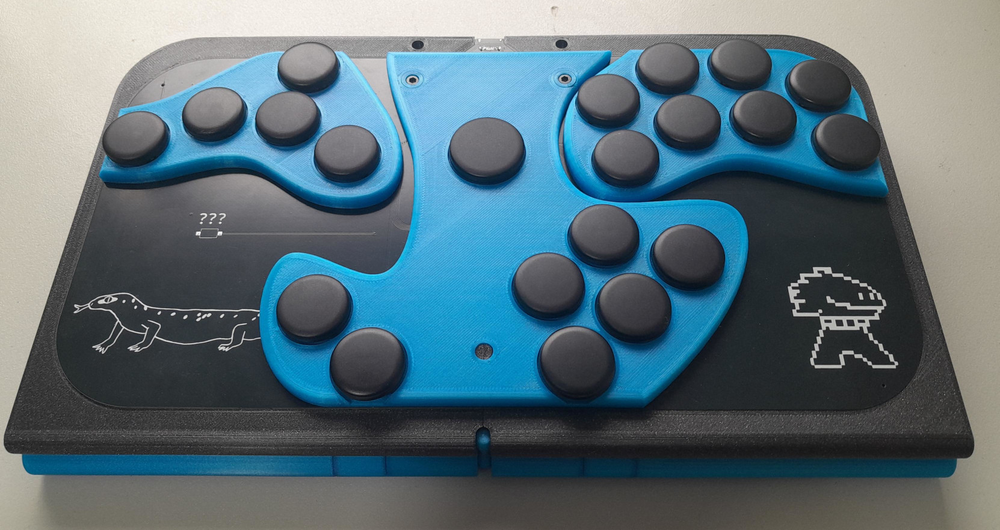
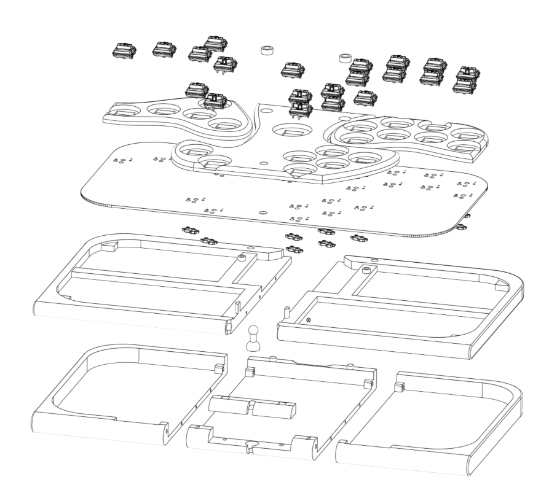

# Rukaibox

A custom hitbox controller for platform fighters.
The PCB used is the [gram slim PCB](https://gramctrl.com/products/gram-slim-pcb)
I have a fork of the PCB in this repo purely because I wanted to tweak some things for my own usage while remaining compatible with the standard gram slim PCB.

This design might be interesting to you if you want a fully 3D printable enclosure with a built in lid that flips underneath the controller when in use.
But keep in mind that when the lid is open, it exposes the PCB as an aesthetic choice, which comes with a risk of damage to the PCB.

I also personally use my own [rukaibox firmware](https://github.com/rukai/rukaibox_firmware).
But the [stock gram haybox firmware](https://github.com/GRAMCTRL/HayBox-GRAM) also works just fine and supports a wider range of protocols, games and MCUs.

## BOM

* A gram slim PCB
  * I ordered mine from jlcpcb from the designs in this repo
  * But you should probably just buy yours from <https://gramctrl.com/products/gram-slim-pcb>
* All the printed parts from [the onshape designs](https://cad.onshape.com/documents/f6e7916fda654a648d842c67/w/2435c624e0afcf5d47216714/e/d2b4fc9888a125d6f744d329?renderMode=0&uiState=6768f678e653c701cfa65dbe).
  1. Convert each part to an STL by going through the `base`, `lid`, `switch plate`, `switch plate left`, `switch plate right`, `join` and `woshua` tabs at the bottom of the page.
  For each tab, click on the tab and then right click on each part on the pane on the left and select export.
  Set the format to STL and keep the rest as default.
  2. Then slice and print each STL yourself.
* M3 Screws (all with head length 3mm, head width 5.3mm):
  * 6 X [bolt length: 13.5mm](https://www.aliexpress.com/item/32810872544.html)
* 6 X [M3 square nuts 5.45mm x 5.45mm x 1.7mm](https://www.aliexpress.com/item/1005001612157787.html)
* 21 x [kailh choc hotswap sockets](https://www.aliexpress.com/item/1005003575767699.html)
* 21 x [kailh choc V1 switches](https://www.aliexpress.com/item/1005005066585322.html) (I used whites for the start button and reds for every other button)
* 21 x [kailh choc V1 buttons](https://www.aliexpress.com/item/1005006902597750.html)
